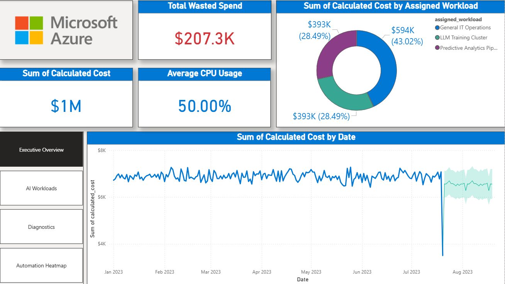

# Azure Cloud FinOps & AI Workload Optimization Dashboard ☁️📊

## 🔗 Quick Links
* **[📥 Download the Interactive Power BI Dashboard (.pbix)](https://1drv.ms/u/c/429fd3f1c5c4ff98/IQDaqX2xg2ZGRLXntn6gnKx6AWK_sdZhyodE5qkxEEMtI4g?e=feBq9p)**
* **[📊 View the Raw Dataset on Kaggle](https://www.kaggle.com/datasets/abdurraziq01/cloud-computing-performance-metrics)**

## 📌 Project Overview
As enterprise cloud computing costs spiral out of control—particularly with the deployment of heavy, resource-intensive AI workloads like LLM training and Predictive Analytics pipelines—engineering and management teams struggle to identify and eliminate wasted spend. 

This project is an end-to-end **Azure Cloud FinOps Dashboard** built in Power BI. It ingests synthetic server telemetry data, processes it through a Star Schema data model, and provides interactive diagnostic tools to hunt down "Zombie Servers" (virtual machines operating at low CPU utilization but high cost).

## 🎯 Business Impact
* **Cost Identification:** Successfully isolated **$207.3K** in simulated wasted cloud spend out of a $1.38M budget (~15% waste ratio).
* **Workload Traceability:** Mapped specific AI workloads to Azure GPU hardware (e.g., NC A100 instances) to trace expenses down to the exact virtual machine ID.
* **Actionable Automation:** Generated an Automation Heatmap to visually expose idle server hours, providing cloud engineering teams with the exact schedules needed to write automated shutdown scripts.

## 🛠️ Tech Stack & Methodologies
* **BI Tool:** Power BI Desktop
* **Data Engineering:** Power Query (M Language) for data transformation, datetime splitting, and conditional column generation.
* **Data Modeling:** Star Schema architecture (1 Fact Table, 3 Dimension Tables).
* **Calculations:** DAX (Data Analysis Expressions) for dynamic measures and financial aggregations.
* **Advanced Analytics:** Exponential Smoothing (30-day forecasting), Root Cause Analysis (Decomposition Tree), and 'What-If' Parameter Simulation.

## 📈 Key Dashboard Features

### 1. Executive Overview
Provides a high-level summary of total cloud spend versus total wasted spend. Features a 30-day predictive forecast and a workload breakdown to immediately identify which AI pipelines are driving the most cost.

### 2. AI Workload Cost Traceability
Utilizes an interactive **Decomposition Tree** to allow stakeholders to drill down from massive operational budgets directly into specific assigned workloads, Azure hardware tiers, and individual VM IDs.

### 3. Zombie Server Diagnostics (Simulator)
A scatter plot matrix identifying servers with high costs and low CPU usage. Includes a dynamic **'What-If' Parameter Slicer** that allows users to adjust the "Zombie" CPU threshold (e.g., from 15% to 20%) and instantly watch the Wasted Spend metrics recalculate in real-time.

### 4. Automation Heatmap
A heavily formatted matrix visual mapping average CPU usage across the days of the week and hours of the day. Identifies exact idle windows (highlighted in red) where servers can be safely automated to shut down, saving compute costs.

## 📂 Repository Structure
* `Capstone_Presentation.pdf`: The slide deck summarizing the business problem, system approach, and results.
* `DataDictionary.md`: Documentation of the Star Schema, DAX measures, and data transformations.
* `/images`: Folder containing high-resolution screenshots of the dashboard pages.

## 🚀 How to Use
1. Download the `.pbix` file using the **Quick Link** at the top of this page.
2. Open the file using Power BI Desktop.
3. Navigate through the pages using the left-hand navigation rail.
4. On the **Diagnostics** page, adjust the "Target CPU Threshold" slider to dynamically simulate cost savings.

## 📄 License
This project is licensed under the Apache License 2.0 - see the [LICENSE](LICENSE) file for details.
